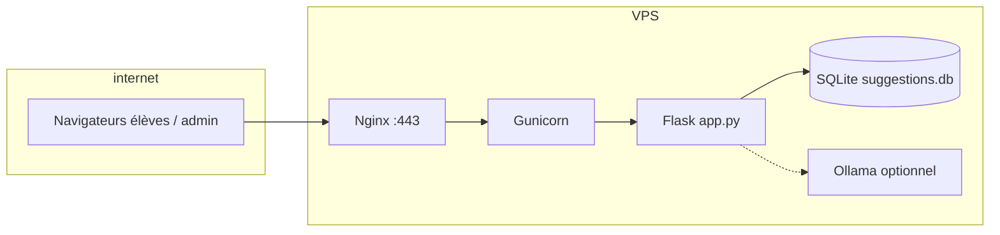

# Tutoriel — Installer la boîte à idées sur un VPS

Ce guide décrit un déploiement **production** sur un serveur Linux (Ubuntu LTS), avec **HTTPS**, **Nginx** comme reverse proxy, **Gunicorn** pour servir l’application Flask, et **systemd** pour la supervision. L’IA locale (**Ollama**) peut tourner sur la même machine ou ailleurs.

---

## 1. Ce que vous allez obtenir



| Composant | Rôle |
|-----------|------|
| **Nginx** | TLS (HTTPS), fichiers statiques possibles, limite de taille des requêtes |
| **Gunicorn** | Processus WSGI, plusieurs workers, redémarrage propre |
| **Flask** | Application `app` dans `app.py` |
| **SQLite** | Fichier `suggestions.db` à la racine du projet (à sauvegarder) |
| **Ollama** | Reformulation / modération IA (optionnel ; fallback sans LLM) |

---

## 2. Prérequis

- Un **VPS** (2 Go RAM minimum recommandé si Ollama est sur le même serveur ; 1 Go peut suffire sans Ollama).
- Un **nom de domaine** pointant vers l’IP du VPS (pour Let’s Encrypt).
- Accès **SSH** en root ou utilisateur avec `sudo`.

**Exemple** : Ubuntu **22.04** ou **24.04** LTS.

---

## 3. Première configuration du serveur

Connectez-vous en SSH, puis :

```bash
sudo apt update && sudo apt upgrade -y
sudo apt install -y python3 python3-venv python3-pip git nginx ufw
```

Créez un utilisateur dédié (recommandé) :

```bash
sudo adduser --disabled-password --gecos "" boite
sudo usermod -aG sudo boite   # seulement si vous voulez sudo pour cet utilisateur
```

Pare-feu minimal :

```bash
sudo ufw allow OpenSSH
sudo ufw allow 'Nginx Full'
sudo ufw enable
```

---

## 4. Déployer le code

En tant qu’utilisateur déployant (ex. `boite` ou `ubuntu`) :

```bash
sudo mkdir -p /var/www/lycee-suggestions
sudo chown $USER:$USER /var/www/lycee-suggestions
cd /var/www/lycee-suggestions
```

Si le projet est sur Git :

```bash
git clone https://github.com/VOTRE_ORG/lycee-suggestions.git .
```

Sinon, copiez le dossier du projet (SFTP, `scp -r`, etc.) dans `/var/www/lycee-suggestions`.

Environnement Python :

```bash
python3 -m venv .venv
source .venv/bin/activate
pip install --upgrade pip
pip install -r requirements.txt
pip install gunicorn
```

Le fichier `suggestions.db` sera créé au premier lancement ; assurez-vous que le répertoire est **inscriptible** par l’utilisateur qui lancera Gunicorn.

---

## 5. Variables d’environnement (sécurité)

**Ne jamais** laisser les valeurs par défaut en production.

Créez un fichier lisible uniquement par root / l’utilisateur du service :

```bash
sudo nano /etc/lycee-suggestions.env
```

Contenu type (adaptez les valeurs) :

```ini
# Obligatoire en production — chaînes longues et aléatoires
SECRET_KEY=changez-moi-une-longue-chaine-secrete-aleatoire
ADMIN_PASSWORD=mot_de_passe_admin_fort

# Cookies de session « Secure » uniquement si le site est servi en HTTPS au navigateur
# (ne pas activer sur accès http://IP — le cookie ne serait pas envoyé)
# SESSION_COOKIE_SECURE=true

# Optionnel : minification JS/CSS (true par défaut dans l’app)
MINIFY=1

# IA locale — si Ollama est sur la même machine
OLLAMA_URL=http://127.0.0.1:11434
OLLAMA_MODEL=gemma3:4b
```

```bash
sudo chmod 600 /etc/lycee-suggestions.env
sudo chown root:root /etc/lycee-suggestions.env
```

Générez un `SECRET_KEY` solide, par exemple :

```bash
python3 -c "import secrets; print(secrets.token_hex(32))"
```

---

## 6. Ollama (optionnel)

Sur le VPS :

```bash
curl -fsSL https://ollama.com/install.sh | sh
sudo systemctl enable ollama
sudo systemctl start ollama
ollama pull gemma3:4b
```

Test : `curl -s http://127.0.0.1:11434/api/tags`

Si Ollama est sur **un autre** serveur, mettez `OLLAMA_URL=http://IP_OU_HOST:11434` et ouvrez le pare-feu en conséquence (idéalement réseau privé uniquement).

---

## 7. Service systemd + Gunicorn

Créez l’unité :

```bash
sudo nano /etc/systemd/system/lycee-suggestions.service
```

Exemple (utilisateur `www-data` souvent utilisé avec Nginx ; vous pouvez utiliser `boite` si vous préférez) :

```ini
[Unit]
Description=Boite a idees lycee (Gunicorn)
After=network.target

[Service]
User=www-data
Group=www-data
WorkingDirectory=/var/www/lycee-suggestions
EnvironmentFile=/etc/lycee-suggestions.env
ExecStart=/var/www/lycee-suggestions/.venv/bin/gunicorn \
  --workers 3 \
  --bind 127.0.0.1:8000 \
  --timeout 120 \
  app:app
Restart=always
RestartSec=5

[Install]
WantedBy=multi-user.target
```

Ajustez les droits pour que `www-data` puisse lire le projet et écrire la base + uploads :

```bash
sudo chown -R www-data:www-data /var/www/lycee-suggestions
sudo chmod 755 /var/www/lycee-suggestions
```

Activez et démarrez :

```bash
sudo systemctl daemon-reload
sudo systemctl enable lycee-suggestions
sudo systemctl start lycee-suggestions
sudo systemctl status lycee-suggestions
```

Les logs :

```bash
journalctl -u lycee-suggestions -f
```

---

## 8. Nginx et HTTPS

**Ordre :** (1) DNS du domaine → IP du VPS, (2) Nginx en HTTP vers Gunicorn, (3) Certbot pour TLS, (4) activer `HTTPS=1` côté app.

### 8.1 — Fichier de site (HTTP uniquement au début)

```bash
sudo nano /etc/nginx/sites-available/lycee-suggestions
```

Remplacez `boite.votredomaine.fr` par votre domaine :

```nginx
server {
    listen 80;
    server_name boite.votredomaine.fr;

    client_max_body_size 25M;

    location / {
        proxy_pass http://127.0.0.1:8000;
        proxy_set_header Host $host;
        proxy_set_header X-Real-IP $remote_addr;
        proxy_set_header X-Forwarded-For $proxy_add_x_forwarded_for;
        proxy_set_header X-Forwarded-Proto $scheme;
        proxy_read_timeout 120s;
    }
}
```

Activez le site et rechargez :

```bash
sudo ln -sf /etc/nginx/sites-available/lycee-suggestions /etc/nginx/sites-enabled/
sudo rm -f /etc/nginx/sites-enabled/default
sudo nginx -t && sudo systemctl reload nginx
```

Vérifiez que `http://boite.votredomaine.fr` répond (sans certificat pour l’instant).

### 8.2 — Certificat Let’s Encrypt

```bash
sudo apt install -y certbot python3-certbot-nginx
sudo certbot --nginx -d boite.votredomaine.fr
```

Certbot modifie la config Nginx pour ajouter **HTTPS** et, en général, la redirection HTTP → HTTPS. Contrôlez avec `sudo nginx -t`.

### 8.3 — Cookies sécurisés côté Flask

Une fois **HTTPS** réellement utilisé par les navigateurs (certificat Let’s Encrypt, URL en `https://`), activez le flag **Secure** sur le cookie de session :

```ini
SESSION_COOKIE_SECURE=true
```

**Sans HTTPS** (accès par `http://` + IP publique) : **ne pas** définir cette variable (défaut = cookies compatibles HTTP).

Puis redémarrez l’application :

```bash
sudo systemctl restart lycee-suggestions
```

---

## 9. Vérifications rapides

| Test | Commande / action |
|------|-------------------|
| Service actif | `systemctl is-active lycee-suggestions` |
| Port local | `curl -sI http://127.0.0.1:8000/` |
| Site public | Navigateur : `https://boite.votredomaine.fr` |
| Admin | `/admin` avec `ADMIN_PASSWORD` |
| Ollama | `curl -s http://127.0.0.1:11434/api/tags` |

---

## 10. Sauvegardes

À minima, sauvegardez régulièrement :

- `suggestions.db`
- le dossier `static/uploads/` (médias éventuels)

Exemple avec `cron` + copie vers un autre emplacement ou machine :

```bash
sudo cp /var/www/lycee-suggestions/suggestions.db /backup/suggestions-$(date +%F).db
```

---

## 11. Mise à jour de l’application

```bash
cd /var/www/lycee-suggestions
sudo systemctl stop lycee-suggestions
# git pull ou déploiement des fichiers
source .venv/bin/activate
pip install -r requirements.txt
python migrate_db.py
sudo systemctl start lycee-suggestions
```

---

## 12. Dépannage

| Symptôme | Piste |
|----------|--------|
| **500 sur `/api/suggestions`**, console : `Unexpected token '<'` (HTML au lieu de JSON) | Souvent une **colonne SQLite manquante** sur une ancienne base. Après mise à jour du code, **redémarrer** le service : au démarrage l’app tente d’ajouter `importance_score` etc. Sinon : `python migrate_db.py` puis redémarrage. Voir les logs : `journalctl -u lycee-suggestions -n 80` |
| **502 Bad Gateway** | Gunicorn arrêté : `journalctl -u lycee-suggestions -n 50` |
| **Permission denied** sur la base | `chown` / droits sur le répertoire du projet |
| **Session qui ne tient pas** / **votes pas enregistrés** | En **HTTPS** : `SESSION_COOKIE_SECURE=true` dans l’env. En **HTTP** (IP sans TLS) : ne pas mettre `SESSION_COOKIE_SECURE=true` ; vérifier `Set-Cookie` dans l’onglet Réseau. |
| **IA ne répond pas** | Ollama : `systemctl status ollama` ; `OLLAMA_URL` |
| **Trop lent** | Augmenter `--timeout` Gunicorn ; alléger le modèle Ollama |

---

## 13. Rappels sécurité

1. **SECRET_KEY** et **ADMIN_PASSWORD** uniques et forts.  
2. Mettre à jour le système : `apt upgrade`.  
3. Ne pas exposer **Ollama** sur Internet sans protection (pare-feu, réseau privé).  
4. Sauvegardes testées (restauration au moins une fois).

---

*Document généré pour le projet « lycee-suggestions » — Flask + SQLite + Nginx + Gunicorn.*
